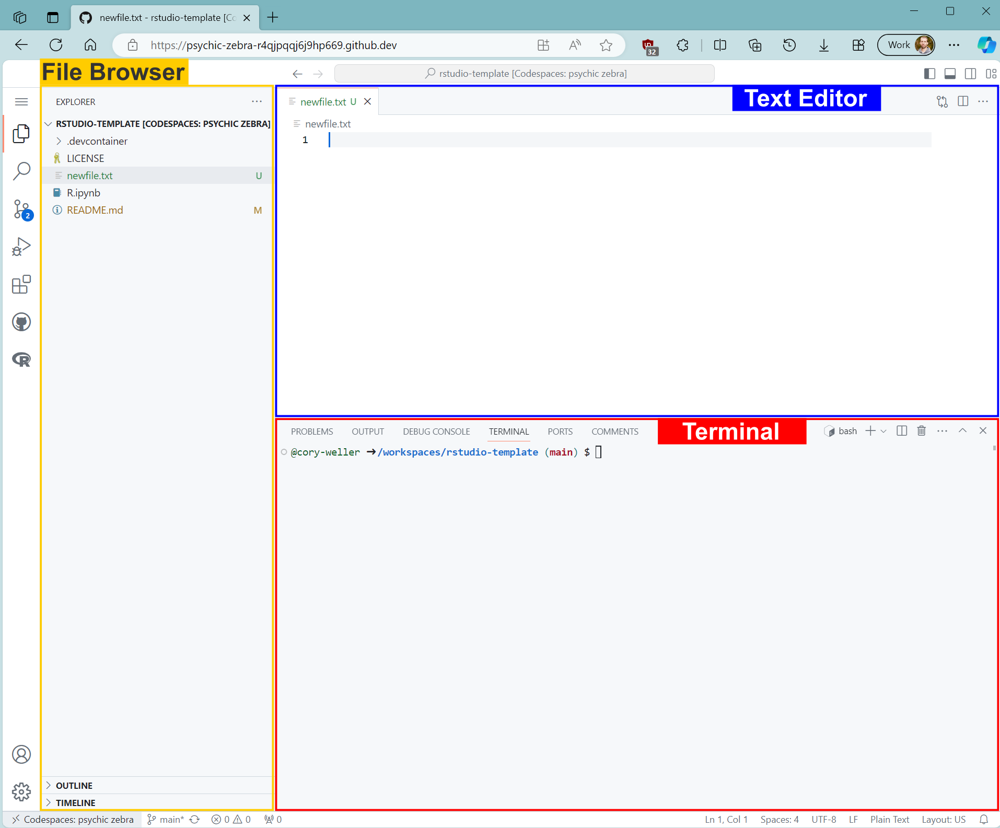

## README

This repository serves as a template `R` environment with `data.table` and `ggplot2` pre-installed.
In short, we can use the VS code text editor interface to connect to an emulated computer and run code over the internet.
The `cw-edu` organization utilizes GitHub for Education, providing educational credits for codespace compute hours.
There should be no cost to you to use the service.
Indidividual topics are included as submodules pointing to their own Git repository.

## Cloud Computing with GitHub Codespaces
GitHub codespaces is a cloud computing service that provides **virtual machine** access. A virtual machine (VM) is an emulated computer system. A single powerful computer can simultaneously emulate many smaller VMs. 

Codespaces are accessed via a **Visual Studio Code** interface. Visual Studio (VS) Code is a text editor with built-in coding features.

To launch your own codespace for this repository, click the green `<> Code` button near the top of this page, ensure the `Codespaces` tab is selected, then `Create codespace on main`.
**Note**: If you already have an active codespace, it will be listed here, and you can click to reconnect.

It will take ~4 minutes for the setup to fully complete the first time.
Once your codespace exists, so long as it isn't deleted due to inactivity, it will reconnect quickly.

Once the VS Code interface loads, you will see something like the following, with three primary sections:


*The File Browser* for viewing file/folder structure, opening/creating/deleting files, or copying (drag and drop) files from other locations. 

*The Text Editor* for viewing or editing text files/Jupyter notebooks, and previewing images.

*The Terminal* for executing commands via the Linux command-line.

The following text indicates the environment is completing setup:
```
Use Cmd/Ctrl + Shift + P -> View Creation Log to see full logs
✔ Finishing up...
⠸ Running postCreateCommand...
  › sudo bash .devcontainer/setup.sh
```
Once setup is complete and you see the following prompt, it is ready for you to use:
```
@your-name ➜ /workspaces/rserver (main) $ 
```

## Running R in the codespace

To run **R in Terminal**, simply execute the command `R` within the terminal at the bottom of the window, and it will start an interactive `R` session.

To run **RStudio**, excute the command `rserver` within the terminal. You will be prompted to click a button to open a new tab containing the `Rstudio` interface.

To run a **Jupyter Notebook**, create or open any file with the `.ipynb` extension. In the upper right corner, click `Select Kernel` and choose `R` (or `Jupyter Kernel/R`). You can then execute `R` code within cell blocks of the notebook. If the `R` kernel is not available, refresh your browser page and try again.
